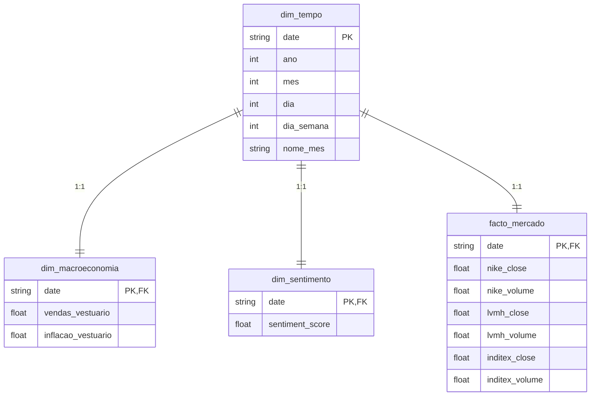

# 👗 TF_ETD: Fashion Retail & Industry Intelligence
*Projeto Prático de ETL, Engenharia de Dados & Visualização Analítica*

---

## 🎯 Visão Geral do Projeto
Análise integrada do setor da **Moda**, cruzando indicadores macroeconómicos de consumo (FRED), performance de mercado de gigantes globais como Nike, LVMH e Inditex (Tiingo) e o sentimento mediático sobre tendências, luxo e sustentabilidade (NewsAPI).

---

## 📅 Semana 1: Extração (Extract) - Concluído
O foco inicial do projeto foi a construção da infraestrutura de coleta automatizada de dados a partir de fontes heterogéneas.

### 🔌 Fontes de Dados e APIs Coletadas:
1. **FRED (Federal Reserve Economic Data)**:
   * `CPIAPPSL`: Índice de Preços ao Consumidor (Inflação de Vestuário).
   * `RSCCAS`: Vendas Mensais a Retalho (Moda e Acessórios).
2. **Tiingo API (Dados de Mercado)**:
   * Dados históricos diários de ações para: Nike (NKE), LVMH (LVMUY) e Inditex (INDITEX).
3. **NewsAPI (Sentimento do Setor)**:
   * Artigos e notícias diárias sobre sustentabilidade, tendências e luxo no mundo da moda.

---

## 📅 Semana 2: Transformação & Qualidade (Transform) - Concluído
Nesta fase, implementámos a limpeza, processamento de sentimento, interpolação temporal de dados FRED e validação de esquema estrito.

### 🏗️ Arquitetura do Pipeline da Semana 2 (Fluxo de Dados)

```mermaid
flowchart TD
    subgraph Camada_Bruta [1. Data Source (Raw CSVs)]
        direction LR
        A[fred_*.csv]
        B[tiingo_*.csv]
        C[noticias_*.csv]
    end

    subgraph Camada_Staging [2. Limpeza & Processamento (Staging)]
        D[transformador.py]
        E[sentimento.py]
        
        A --> D
        B --> D
        C --> E
        
        D --> F[indicadores_retalho_limpos.csv]
        D --> G[mercado_*.csv]
        E --> H[sentimento_diario_limpo.csv]
    end

    subgraph Camada_Gold [3. Integração & Fusão (Gold)]
        I[integrador.py]
        
        F --> I
        G --> I
        H --> I
        
        I --> J[ouro_analise_moda.csv]
    end

    subgraph Camada_Auditoria [4. Auditoria de Qualidade]
        K[validador.py]
        
        J --> K
        K --> L[relatorio_qualidade.md]
        K --> M[transformacao.log]
    end
    
    style Camada_Bruta fill:#f9f,stroke:#333,stroke-width:2px
    style Camada_Staging fill:#bbf,stroke:#333,stroke-width:2px
    style Camada_Gold fill:#f96,stroke:#333,stroke-width:2px
    style Camada_Auditoria fill:#bfb,stroke:#333,stroke-width:2px
```

### 🛠️ Processamentos Implementados:
1. **Limpeza e Padronização**: Conversão de tipos financeiros, tratamento de NaNs e eliminação de duplicados por data.
2. **Análise Léxica de Sentimento**: Processamento dos títulos de notícias com classificação numérica de sentimento diário `[-1.0 a +1.0]`.
3. **Interpolação FRED**: Reamostragem dos dados macroeconómicos mensais para base diária utilizando propagação controlada (*forward-fill* e *backward-fill*).
4. **Validação Estrita via Pydantic**: Schemas de validação em tempo de execução garantem a conformidade do dataset Gold consolidado (`ouro_analise_moda.csv` contendo 343 registos limpos).

---

## 📅 Semana 3: Carregamento (Load) - Concluído
Implementação da persistência física e da modelação relacional dimensional numa base de dados **SQLite** com validações de integridade.

### 🏗️ Modelação Relacional (Star Schema ERD)



### 🛠️ Armazenamento & View Analítica:
1. **Star Schema no SQLite**: Normalização otimizada para séries temporais dividida em 3 tabelas dimensionais e 1 tabela de factos.
2. **View Consolida (`view_analitica_consolidada`)**: Camada de abstração que unifica os relacionamentos para posterior visualização analítica, otimizando o tempo de consulta e simplificando queries no dashboard.
3. **Carga e Auditoria Pós-Carga**: O script [carregador_dados.py](src/3_carregamento/scripts/carregador_dados.py) realiza a injeção na base de dados em `src/3_carregamento/dados/moda_analytics.db` e gera automaticamente o relatório técnico `relatorio_valida_carga.md` provando a integridade referencial a 100%.

### 🚀 Como Executar o Carregamento (Fase 3)
```bash
python3 src/3_carregamento/scripts/carregador_dados.py
```
