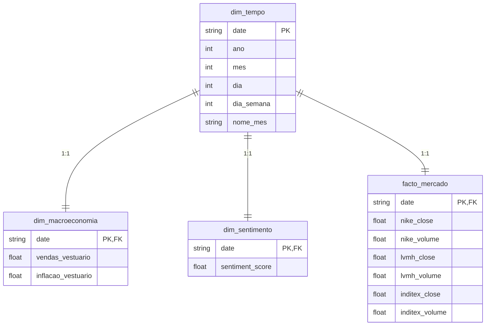

# 👗 TF_ETD: Fashion Retail & Industry Intelligence
*Projeto Prático de ETL, Engenharia de Dados & Visualização Analítica*

---

## 🎯 Visão Geral do Projeto
Análise integrada do setor da **Moda**, cruzando indicadores macroeconómicos de consumo (FRED), performance de mercado de gigantes globais como Nike, LVMH e Inditex (Tiingo) e o sentimento mediático sobre tendências, luxo e sustentabilidade (NewsAPI).

---

## 📅 Semana 1: Extração (Extract) - Concluído
O foco inicial do projeto foi a construção da infraestrutura de coleta automatizada de dados a partir de fontes heterogéneas.

### 🔌 Fontes de Dados e APIs Coletadas:
1. **FRED (Federal Reserve Economic Data)**:
   * `CPIAPPSL`: Índice de Preços ao Consumidor (Inflação de Vestuário).
   * `RSCCAS`: Vendas Mensais a Retalho (Moda e Acessórios).
2. **Tiingo API (Dados de Mercado)**:
   * Dados históricos diários de ações para: Nike (NKE), LVMH (LVMUY) e Inditex (INDITEX).
3. **NewsAPI (Sentimento do Setor)**:
   * Artigos e notícias diárias sobre sustentabilidade, tendências e luxo no mundo da moda.

---

## 📅 Semana 2: Transformação & Qualidade (Transform) - Concluído
Fase focada em converter e padronizar os dados brutos extraídos numa base consolidada e robusta para modelação:
*   **Limpeza & Padronização**: Remoção de duplicados, tratamento de valores omissos e alinhamento temporal.
*   **Sentimento Léxico**: Pontuação de sentimento diário `[-1.0 a +1.0]` de notícias recolhidas via NewsAPI.
*   **Interpolação FRED**: Propagação de dados macroeconómicos mensais para base diária via forward-fill (`ffill`).
*   **Validação Pydantic**: Execução de suite de validação de schemas em tempo de execução garantindo a integridade absoluta do dataset Gold consolidado (`ouro_analise_moda.csv` contendo 343 registos em total conformidade).

---

## 📅 Semana 3: Carregamento (Load) - Concluído
Implementação da persistência física e da modelação relacional dimensional numa base de dados **SQLite** com validações de integridade.

### 🏗️ Modelação Relacional (Star Schema ERD)



### 🛠️ Armazenamento & View Analítica:
1. **Star Schema no SQLite**: Normalização otimizada para séries temporais dividida em 3 tabelas dimensionais e 1 tabela de factos.
2. **View Consolida (`view_analitica_consolidada`)**: Camada de abstração que unifica os relacionamentos para posterior visualização analítica, otimizando o tempo de consulta e simplificando queries no dashboard.
3. **Carga e Auditoria Pós-Carga**: O script [carregador_dados.py](src/3_carregamento/carregador_dados.py) realiza a injeção na base de dados em `data/moda_analytics.db` e gera automaticamente o relatório técnico `relatorio_valida_carga.md` provando a integridade referencial a 100%.

### 🚀 Como Executar o Carregamento (Fase 3)
```bash
python3 src/3_carregamento/carregador_dados.py
```
